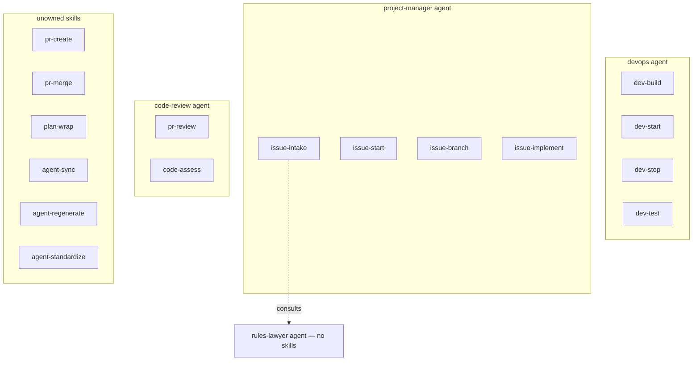
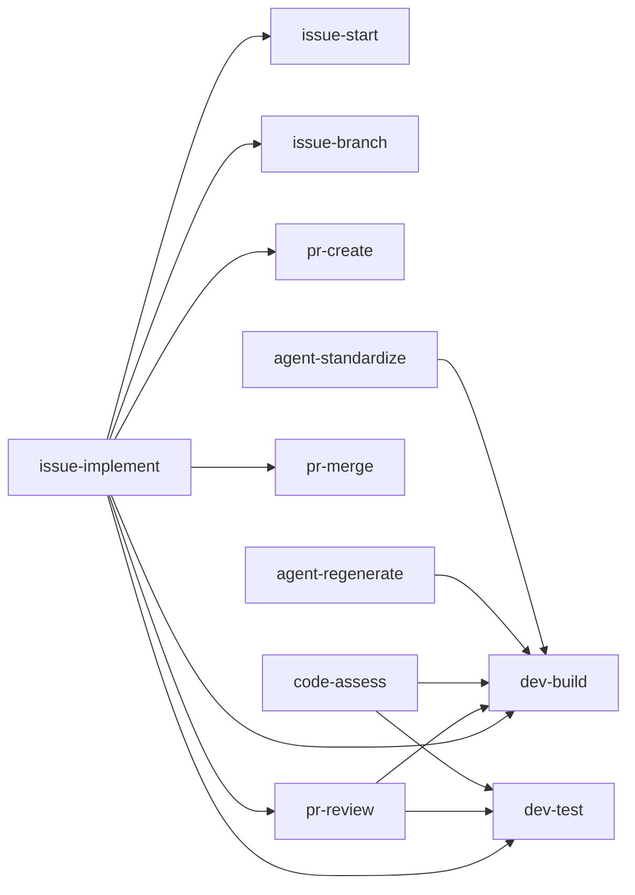
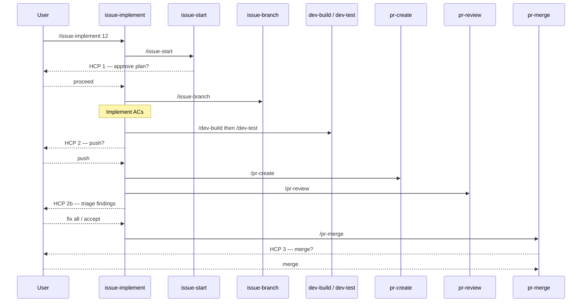

# lob-online Agent & Skill Architecture

## Overview

lob-online uses Claude Code agents and skills to automate the development lifecycle. Agents are
specialised subprocesses spawned by the main Claude Code session; skills are reusable Markdown
prompt files invoked with `/skill-name`. This document describes how they relate, which skills
call which, and how the issue-to-merge workflow is sequenced.

---

## Skill Sharing: Best Practice Decision

**Decision: skills are freely composable across agents.**

Skills are atomic utility functions — analogous to shell scripts. Any agent or skill may call
any other skill. Agent ownership is documented for routing and UX purposes only (it answers
"which agent should I invoke for this task?"), not to restrict which callers may use a skill.

The alternative — exclusive ownership — would require duplicating build/test logic in every skill
that needs a quality gate, which is a clear DRY violation.

### Skill tiers

| Tier             | Examples                                                                                                              | Description                                                                                      |
| ---------------- | --------------------------------------------------------------------------------------------------------------------- | ------------------------------------------------------------------------------------------------ |
| **Leaf**         | `dev-build`, `dev-start`, `dev-stop`, `dev-test`, `pr-create`, `pr-merge`, `issue-start`, `issue-branch`, `plan-wrap` | Callable by anyone; no sub-skill dependencies                                                    |
| **Composite**    | `pr-review`, `code-assess`                                                                                            | Call leaf skills as prerequisites                                                                |
| **Orchestrator** | `issue-implement`                                                                                                     | Explicitly cross-domain; chains skills from multiple categories in a single user-facing workflow |

---

## Agents

| Agent             | Description                                 | Primary Skills                                                       | Collaborators                        |
| ----------------- | ------------------------------------------- | -------------------------------------------------------------------- | ------------------------------------ |
| `devops`          | Build, run, and test the dev environment    | `/dev-build`, `/dev-start`, `/dev-stop`, `/dev-test`                 | —                                    |
| `project-manager` | Manage SDLC: issues → milestones → backlog  | `/issue-intake`, `/issue-start`, `/issue-branch`, `/issue-implement` | `rules-lawyer` (via `/issue-intake`) |
| `code-review`     | Quality-gate PR reviews and codebase audits | `/pr-review`, `/code-assess`                                         | `devops` skills as prerequisites     |
| `rules-lawyer`    | Authoritative LoB v2.0 rules arbiter        | none                                                                 | Consulted by `project-manager`       |

---

## Skills

| Skill                | Category | Description                                        | Owning Agent    | Calls                     |
| -------------------- | -------- | -------------------------------------------------- | --------------- | ------------------------- |
| `/dev-build`         | dev      | Format → lint → Vite build                         | devops          | —                         |
| `/dev-start`         | dev      | Launch server + Vite client                        | devops          | —                         |
| `/dev-stop`          | dev      | Graceful shutdown, SIGKILL fallback                | devops          | —                         |
| `/dev-test`          | dev      | Run suite, detect flakes, correlate errors         | devops          | —                         |
| `/issue-intake`      | issue    | Draft and file AI-actionable GitHub issue          | project-manager | rules-lawyer agent        |
| `/issue-start`       | issue    | Fetch issue, summarise ACs, HCP 1                  | project-manager | —                         |
| `/issue-branch`      | issue    | Create feat branch, log update                     | project-manager | —                         |
| `/issue-implement`   | issue    | Full ticket-to-merge orchestrator                  | project-manager | 7 sub-skills              |
| `/pr-create`         | pr       | Devlog entry + CI checks + open PR                 | unowned         | —                         |
| `/pr-review`         | pr       | Build/test gate + PR diff analysis                 | code-review     | `/dev-build`, `/dev-test` |
| `/pr-merge`          | pr       | Squash-merge + branch delete, HCP 3                | unowned         | —                         |
| `/plan-wrap`         | plan     | Post-plan: verify build, write devlog, update docs | unowned         | —                         |
| `/code-assess`       | code     | Full source audit (dead/dup/coverage)              | code-review     | `/dev-build`, `/dev-test` |
| `/agent-sync`        | agent    | Read-only drift check agents vs design.md          | unowned         | —                         |
| `/agent-regenerate`  | agent    | Rebuild agent files from design.md §4              | unowned         | `/dev-build`              |
| `/agent-standardize` | agent    | Normalize prompt.md, regenerate design + agents    | unowned         | `/dev-build`              |

---

## Skill Dependency Graph

---

## Issue-to-Merge Workflow

---

## Adding New Agents and Skills

- **New skill:** see the six-step guide in [`docs/agents/README.md`](agents/README.md#how-to-create-a-new-skill)
  and use [`docs/agents/SKILL_TEMPLATE.md`](agents/SKILL_TEMPLATE.md) as the starting point.
- **New agent:** see [`docs/agents/README.md`](agents/README.md#how-to-create-a-new-agent)
  and use [`docs/agents/PROMPT_TEMPLATE.md`](agents/PROMPT_TEMPLATE.md) and
  [`docs/agents/DESIGN_TEMPLATE.md`](agents/DESIGN_TEMPLATE.md).
- After adding either, run `/agent-sync` to verify consistency, then `/dev-build` to confirm
  no lint/format issues.
