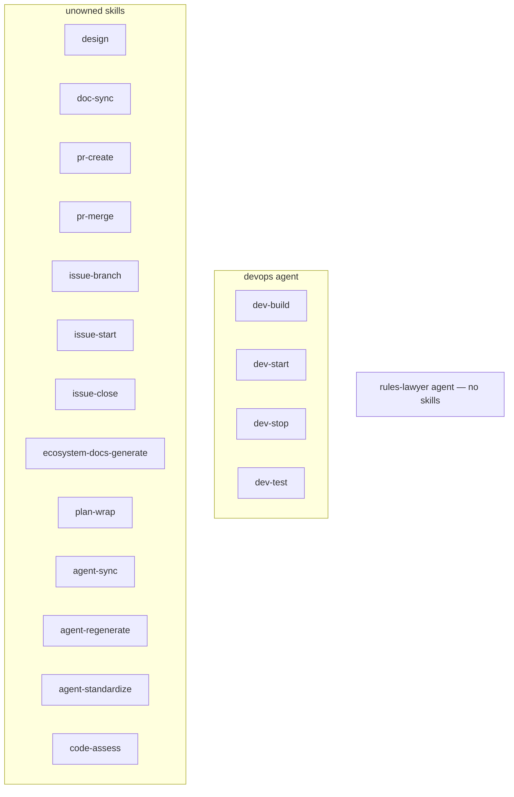
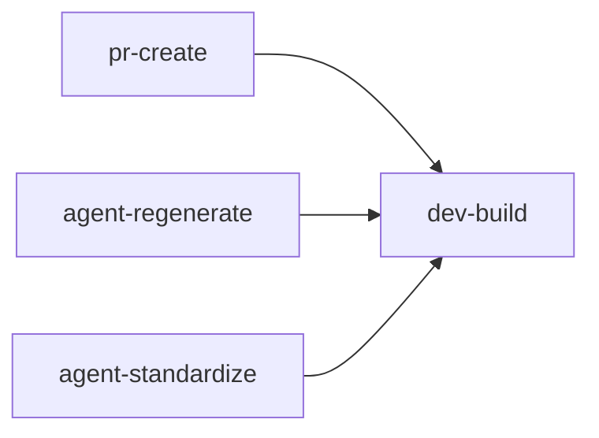

# Network Diagrams

> Auto-generated by /ecosystem-docs-generate — do not edit by hand.
> Source of truth: docs/agents/\*/design.md, .claude/agents/registry.json,
> .claude/commands/\*.md

Static structural diagrams showing agent/skill ownership and skill call dependencies. The
lob-specific ecosystem has two layers: **agents** (scope) → **skills** (procedure).
Orchestration is provided by the wshobson/agents plugins (`conductor`, `agent-teams`) —
see [orchestration.md](orchestration.md).

All diagrams are rendered from Mermaid — any Markdown viewer with Mermaid support (GitHub,
VS Code + extension, Obsidian) will display them as graphs.

---

## 1. Agent and Skill Ownership

Which agent owns which skills, and unowned (lob-specific extension) skills.

---

## 2. Skill Dependency Graph

Which skills call other skills as prerequisites or sub-steps.

