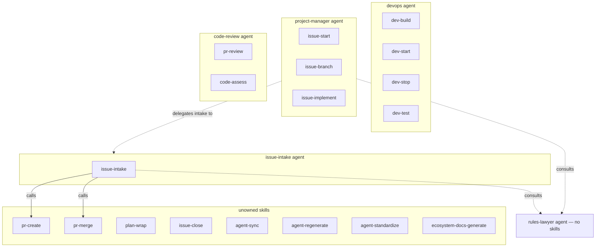
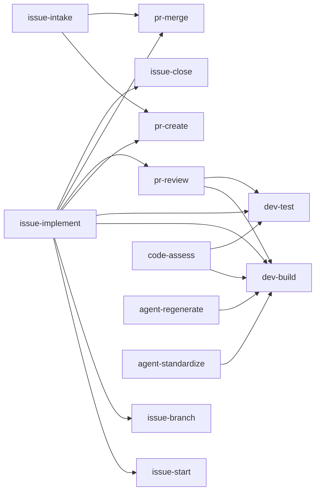

# Network Diagrams

> Auto-generated by /ecosystem-docs-generate — do not edit by hand.
> Source of truth: docs/agents/\*/design.md, .claude/agents/registry.json,
> .claude/commands/\*.md, docs/workflows/\*/

Static structural diagrams showing agent/skill ownership and skill call dependencies. For
workflow execution diagrams (SDLC sequence, intake flowchart), see
[orchestration.md](orchestration.md). The three-layer ecosystem: **agents** (scope) →
**skills** (procedure) → **orchestration** (sequencing with gate checkpoints).

All diagrams are rendered from Mermaid — any Markdown viewer with Mermaid support (GitHub,
VS Code + extension, Obsidian) will display them as graphs.

---

## 1. Agent and Skill Ownership

Which agent owns which skills, and how agents collaborate.

---

## 2. Skill Dependency Graph

Which skills call other skills as prerequisites or sub-steps.

