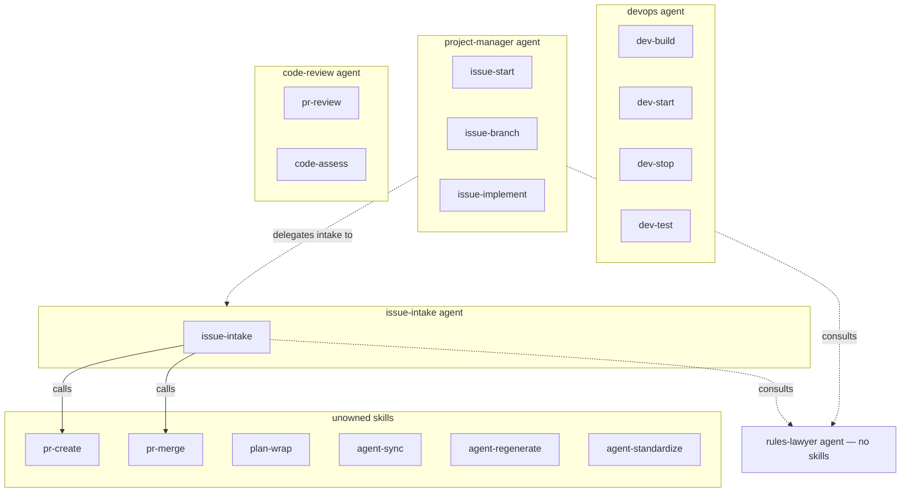
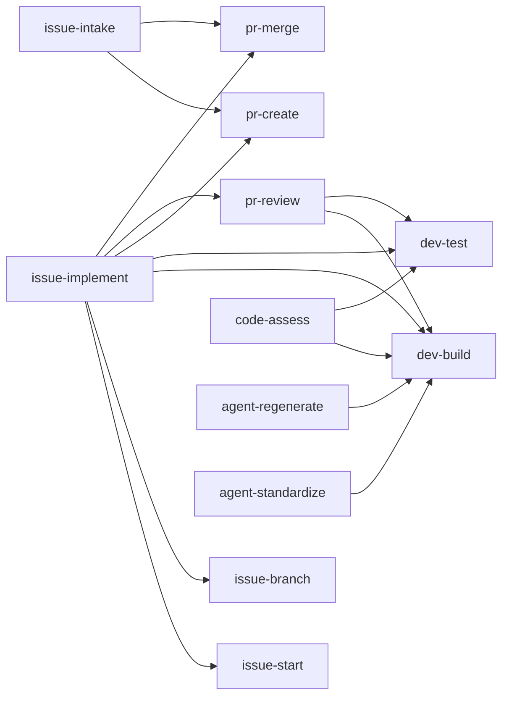
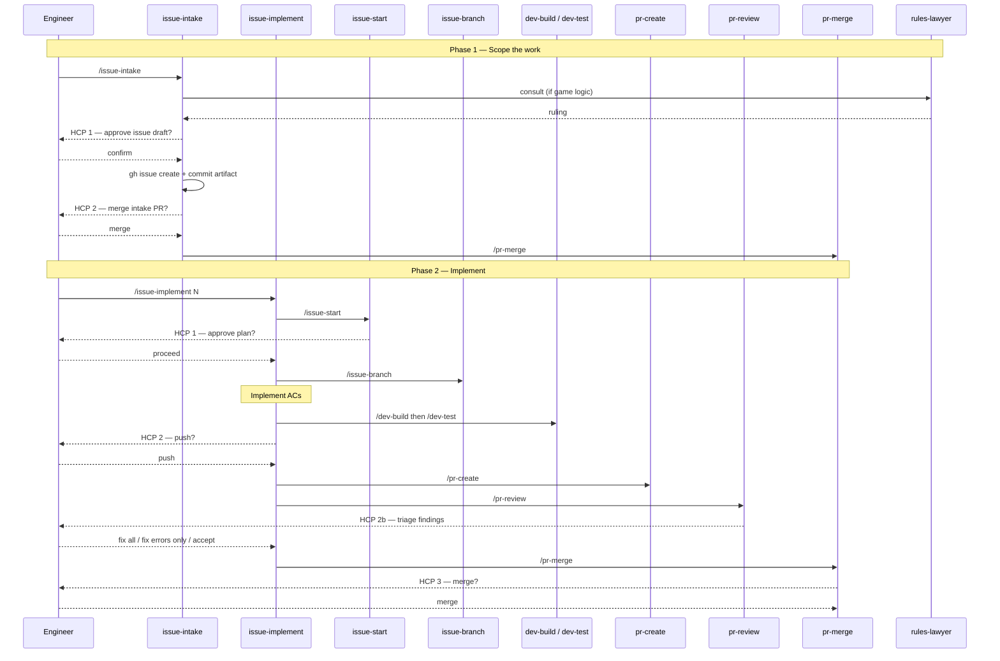
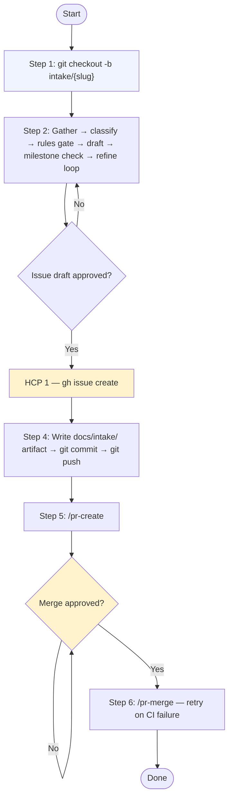

# Network Diagrams

Visual overview of how agents, skills, and workflows relate in lob-online. All diagrams are
rendered from Mermaid — any Markdown viewer with Mermaid support (GitHub, VS Code + extension,
Obsidian) will display them as graphs.

---

## 1. Agent and Skill Ownership

Which agent owns which skills, and how agents collaborate.

---

## 2. Skill Dependency Graph

Which skills call other skills as prerequisites or sub-steps.

---

## 3. Full SDLC Sequence — Issue to Merge

The complete flow from a raw idea to a squash-merged pull request, showing all human control
points (HCPs) where the engineer must give explicit approval before the workflow continues.

---

## 4. Issue Intake Detail

The six steps inside `/issue-intake`, showing the two HCPs and the code-free scope constraint.

