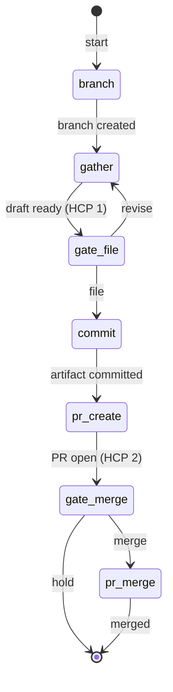
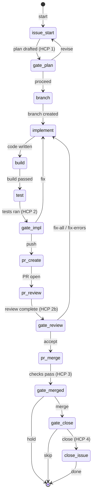
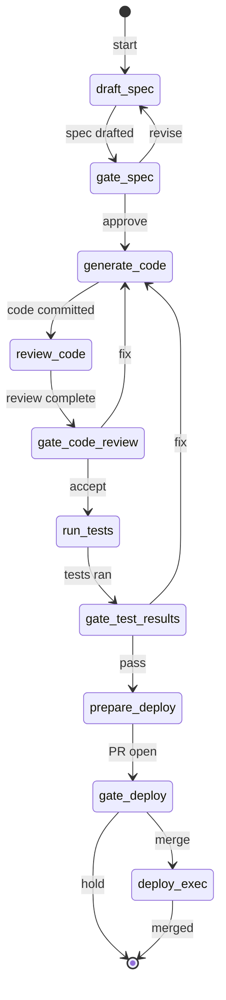
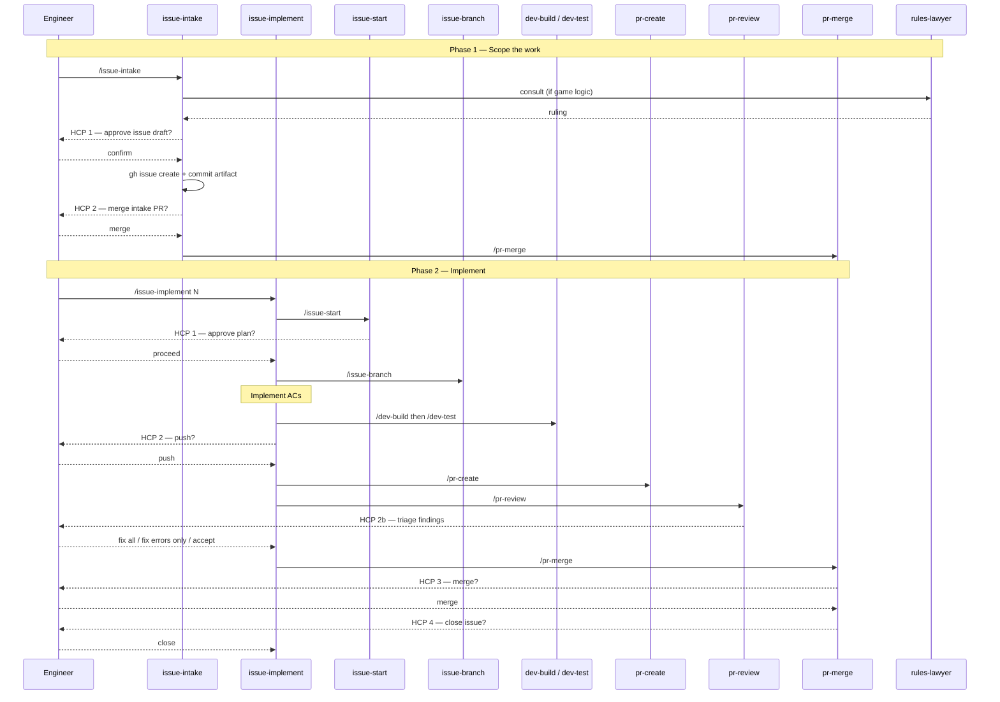
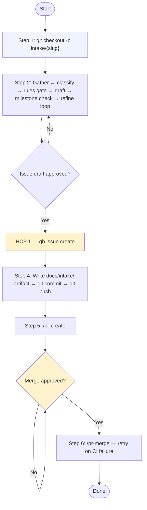

# Orchestration

> Auto-generated by /ecosystem-docs-generate — do not edit by hand.
> Source of truth: docs/agents/\*/design.md, .claude/agents/registry.json,
> .claude/commands/\*.md, docs/workflows/\*/

The orchestration layer is the third primitive in the lob-online ecosystem. **Agents** define
scope (what a subprocess is allowed to do). **Skills** define procedure (steps in what
order). **Orchestration** defines sequencing as version-controlled data — when and in what
order to invoke agents and skills, with blocking gate checkpoints between them where the
engineer must provide an explicit decision before the pipeline continues.

---

## Runtime

The Node.js workflow engine lives in `server/src/orchestrator/` and is composed of three
modules:

- **`schemas.js`** — Zod validation for all five domain types (`AgentManifest`, `GateDef`,
  `StepDef`, `WorkflowDefinition`, `WorkflowInstance`)
- **`registry.js`** — loads `.claude/agents/registry.json` and resolves agents by `id`
- **`runtime.js`** — step executor, JSONPath `inputMap` resolution, CLI readline gate
  handler, loop-back routing, and `WorkflowInstance` JSON persistence

---

## `WorkflowDefinition` Schema

A workflow definition is a JSON file with four top-level fields:

```json
{
  "id": "workflow-id",
  "name": "Human-readable name",
  "description": "One sentence describing the workflow end-to-end.",
  "steps": [ ... ]
}
```

### Agent step

```json
{
  "id": "step-id",
  "name": "Human-readable step name",
  "agentId": "registry-id",
  "inputMap": { "key": "$.prior-step-id.outputField" },
  "onError": "halt"
}
```

- `agentId` — must match an `id` in `.claude/agents/registry.json`
- `inputMap` — can be `{}` if no prior step output is needed
- `onError` — `"halt"` (default) or `"continue_with_warning"`

### Gate step (human control point)

```json
{
  "id": "gate-id",
  "name": "Gate: Description (HCP N)",
  "agentId": null,
  "inputMap": {},
  "onError": "halt",
  "gateConfig": {
    "prompt": "What the engineer sees and is deciding.",
    "choices": [
      { "label": "Proceed", "value": "proceed", "onChoice": { "nextStep": null } },
      { "label": "Revise", "value": "revise", "onChoice": { "nextStep": "earlier-step-id" } }
    ],
    "defaultChoice": "proceed"
  }
}
```

- `agentId: null` signals a gate step
- `nextStep: null` advances to the immediately following step
- `nextStep: "step-id"` loops back; must be a valid step `id` in this workflow
- `defaultChoice` is selected when the engineer presses Enter without typing

---

## Runtime Capabilities

### JSONPath `inputMap`

Each step's `inputMap` threads outputs from prior steps into the current step's input.
The runtime resolves `$.stepId.field.subfield` expressions against the accumulated
`stepResults` object. Example: if `issue-start` returns `{ issueNumber: 42 }`, a later step
can receive it as `inputMap: { "issue": "$.issue-start.issueNumber" }`.

### Loop-back routing

A gate choice with a non-null `nextStep` restarts execution at that earlier step. The
`WorkflowInstance` state is preserved — prior `stepResults` and `gateDecisions` are kept —
so the re-run sees all outputs from the first pass. This is how "revise" and "fix" paths work
without branching into a separate workflow.

### `WorkflowInstance` persistence

After every step the runtime writes a `WorkflowInstance` JSON file to `docs/ailog/` as
`{runId}-instance.json`. Fields: `workflowId`, `runId`, `status` (running / completed /
failed / waiting_at_gate), `startedAt`, `updatedAt`, `stepResults` (stepId → output),
`gateDecisions` (array of `{ gateId, choice, note, timestamp }`), `currentStep`.

---

## Workflow Definitions

### `issue-intake` — 7 steps, 2 gates

**Purpose:** Turn a raw requirement into a filed, milestone-assigned GitHub issue backed by
a committed intake artifact on its own branch and pull request.

**Source:** `docs/workflows/issue-intake/issue-intake.workflow.json`



| Gate ID      | Prompt summary                             | Choices      | Default | Loop-back risk                 |
| ------------ | ------------------------------------------ | ------------ | ------- | ------------------------------ |
| `gate-file`  | Full draft shown; file on GitHub or revise | file, revise | file    | `revise` → returns to `gather` |
| `gate-merge` | PR open; merge intake branch or hold       | merge, hold  | merge   | `hold` terminates; no loop     |

---

### `issue-implement` — 14 steps, 5 gates

**Purpose:** Full ticket-to-merge workflow: issue start → branch → implement → build → test
→ PR → review → merge → close issue, with five human gate checkpoints.

**Source:** `docs/workflows/issue-implement/issue-implement.workflow.json`



| Step ID       | Prompt summary                                      | Choices                     | Default | Loop-back risk                                |
| ------------- | --------------------------------------------------- | --------------------------- | ------- | --------------------------------------------- |
| `gate-plan`   | Plan + AC checklist shown; proceed or revise        | proceed, revise             | proceed | `revise` → re-runs `issue-start`              |
| `gate-impl`   | Build + test results shown; push or fix             | push, fix                   | push    | `fix` → re-runs `implement`; may loop on test |
| `gate-review` | PR review findings; accept, fix-all, or fix-errors  | accept, fix-all, fix-errors | accept  | `fix-*` → re-runs `implement`; may loop       |
| `gate-merged` | Final merge approval; merge or hold                 | merge, hold                 | merge   | `hold` terminates; no loop                    |
| `gate-close`  | Issue close confirmation after merge; close or skip | close, skip                 | close   | `skip` terminates; no loop                    |

---

### `sdlc-feature` — 10 steps, 4 gates

**Purpose:** End-to-end feature delivery pipeline: spec → code → review → test → deploy,
with blocking human gate checkpoints at each transition.

**Source:** `docs/workflows/sdlc-feature/sdlc-feature.workflow.json`



| Step ID             | Prompt summary                       | Choices         | Default | Loop-back risk                            |
| ------------------- | ------------------------------------ | --------------- | ------- | ----------------------------------------- |
| `gate-spec`         | Review spec draft; approve or revise | approve, revise | approve | `revise` → re-runs `draft-spec`           |
| `gate-code-review`  | Review findings; accept or fix       | accept, fix     | accept  | `fix` → re-runs `generate-code`; may loop |
| `gate-test-results` | Review test output; pass or fix      | pass, fix       | pass    | `fix` → re-runs `generate-code`; may loop |
| `gate-deploy`       | Final merge approval; merge or hold  | merge, hold     | merge   | `hold` terminates without merge           |

---

## SDLC Sequence — Issue to Merge

The complete flow from raw idea to squash-merged pull request, showing all human control
points where the engineer must give explicit approval before the workflow continues.



---

## Intake Detail Flowchart

The six steps inside `/issue-intake`, showing the two HCPs and the code-free scope
constraint.



---

## How to Add a New Workflow

1. **Plan** — list all steps, mark gates, decide loop-back choices and `inputMap` flows
2. **Create directory** — `mkdir -p docs/workflows/<workflow-id>/`
3. **Write `.workflow.json`** — at `docs/workflows/<id>/<id>.workflow.json`; validate every
   `agentId` against `registry.json`
4. **Write `.states.md`** — description, Mermaid `stateDiagram-v2`, gate checkpoint table
5. **Verify registry** — every non-null `agentId` must have a matching entry in
   `.claude/agents/registry.json`
6. **Validate** — `npm test` covers `WorkflowDefinitionSchema`; or run a manual Zod parse
7. **Build check** — `/dev-build` catches JSON syntax errors and format issues
