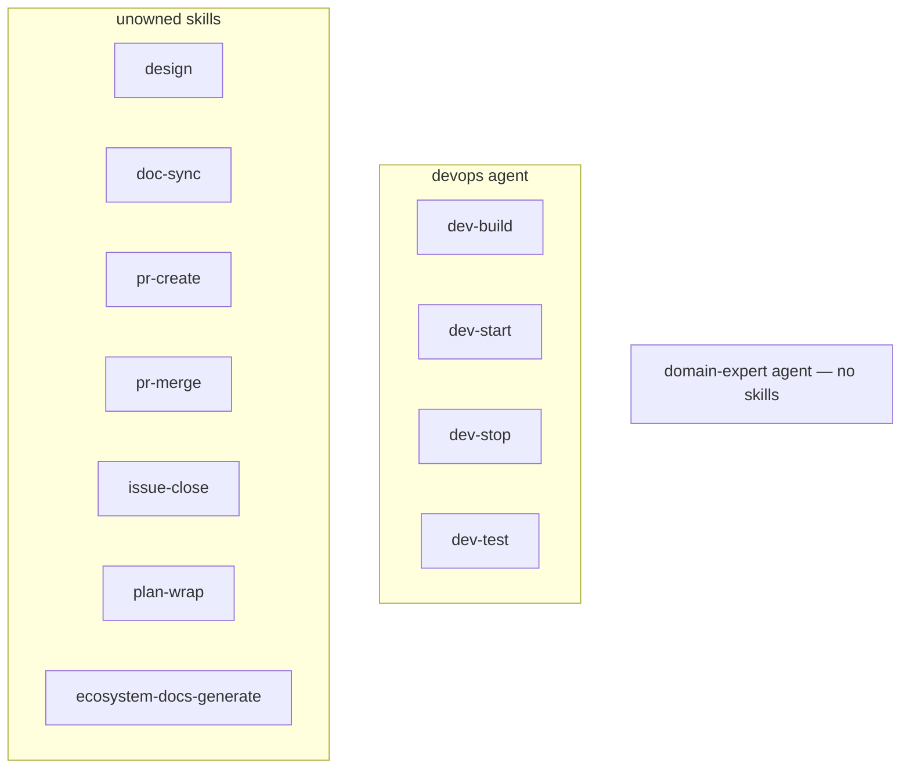
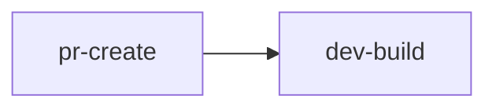

# lob-online Ecosystem Design

> Auto-generated by /ecosystem-docs-generate — do not edit by hand.
> Source of truth: docs/agents/\*/design.md, .claude/agents/registry.json,
> .claude/commands/\*.md

lob-online uses Claude Code **agents** and **skills** as its lob-specific automation
layer, with the [wshobson/agents](https://github.com/wshobson/agents) plugin marketplace
(`conductor`, `agent-teams`) as its primary SDLC orchestration layer. Agents are
specialised AI subprocesses with defined responsibility boundaries and explicit tool
allowlists. Skills are reusable Markdown prompt files that encode step-by-step procedures
and compose freely across agent boundaries. Orchestration sequences work into tracked
implementation units (`conductor`) and parallel review or debug teams (`agent-teams`).
For the full reference, see [`docs/claude-ecosystem/`](claude-ecosystem/).

---

## Skill Sharing: Best Practice Decision

**Skills are freely composable across agents.** Any agent or skill may call any other
skill. Agent ownership records routing accountability, not call restrictions.

### Skill tiers

| Tier          | Examples                                                                                              | Description                                   |
| ------------- | ----------------------------------------------------------------------------------------------------- | --------------------------------------------- |
| **Leaf**      | `dev-build`, `dev-start`, `dev-stop`, `dev-test`, `pr-create`, `pr-merge`, `plan-wrap`, `issue-close` | No sub-skill dependencies; callable by anyone |
| **Composite** | `pr-create`                                                                                           | Calls `/dev-build` as a prerequisite          |

---

## Agents

Two agents are registered in `.claude/agents/registry.json`. All other SDLC orchestration
is provided by the wshobson/agents plugin (`conductor`, `agent-teams`).

| Agent           | Description                                      | Primary Skills                                       | Collaborators                   |
| --------------- | ------------------------------------------------ | ---------------------------------------------------- | ------------------------------- |
| `devops`        | Build, run, and test the dev environment         | `/dev-build`, `/dev-start`, `/dev-stop`, `/dev-test` | —                               |
| `domain-expert` | Authoritative LoB v2.0 rules arbiter (read-only) | none                                                 | Consulted for game-logic tracks |

---

## Skills

| Skill                      | Category | Description                                        | Owning Agent           | Calls        |
| -------------------------- | -------- | -------------------------------------------------- | ---------------------- | ------------ |
| `/dev-build`               | dev      | Format → lint → Vite build                         | devops                 | —            |
| `/dev-start`               | dev      | Launch server + Vite client                        | devops                 | —            |
| `/dev-stop`                | dev      | Graceful shutdown, SIGKILL fallback                | devops                 | —            |
| `/dev-test`                | dev      | Run suite, detect flakes, correlate errors         | devops                 | —            |
| `/design`                  | docs     | Gather intent → draft design doc → commit + PR     | unowned                | —            |
| `/issue-close`             | issue    | Close GitHub issue with merge summary comment      | unowned                | —            |
| `/pr-create`               | pr       | Devlog entry + CI checks + open PR                 | unowned                | `/dev-build` |
| `/pr-merge`                | pr       | Squash-merge + branch delete                       | unowned                | —            |
| `/plan-wrap`               | plan     | Post-plan: verify build, write devlog, update docs | unowned (unregistered) | —            |
| `/doc-sync`                | docs     | Sync CLAUDE.md, HLD, and agent design docs         | unowned                | —            |
| `/ecosystem-docs-generate` | docs     | Regenerate all ecosystem docs from source inputs   | unowned                | —            |

---

## Skill Dependency Graph

---

## Key Files

| File / Path                         | What it is                                                          |
| ----------------------------------- | ------------------------------------------------------------------- |
| `.claude/agents/*.md`               | Agent definitions (frontmatter + system prompt)                     |
| `.claude/agents/registry.json`      | Programmatic agent/skill index                                      |
| `.claude/commands/*.md`             | Skill command files                                                 |
| `docs/agents/*/design.md`           | Canonical source of truth for each agent (§4 → agent file)          |
| `docs/claude-ecosystem/`            | Full reference hub: agents, skills, orchestration, guardrails       |
| `docs/designs/ecosystem-design.md`  | This file — top-level architecture overview                         |
| `docs/migration-wshobson-agents.md` | Old-to-new command mapping from hand-rolled SDLC to wshobson/agents |

---

## Adding New Agents and Skills

- **New skill:** use [`docs/agents/SKILL_TEMPLATE.md`](agents/SKILL_TEMPLATE.md) as the
  template for `.claude/commands/<name>.md`, add a registry entry in
  `.claude/agents/registry.json`, then run `/dev-build`.
- **New agent:** use [`docs/agents/PROMPT_TEMPLATE.md`](agents/PROMPT_TEMPLATE.md) and
  [`docs/agents/DESIGN_TEMPLATE.md`](agents/DESIGN_TEMPLATE.md); add a registry entry;
  run `/dev-build`.
- **New conductor track:** run `/conductor:new-track` to scope and plan. See
  [`tutorial-orchestration.md`](claude-ecosystem/tutorial-orchestration.md).
