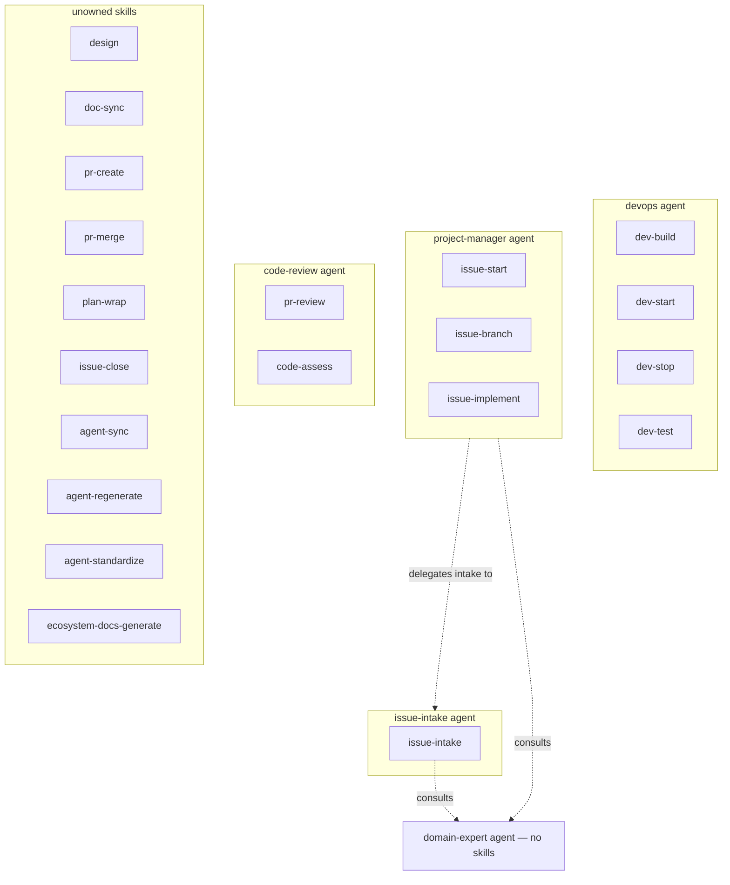
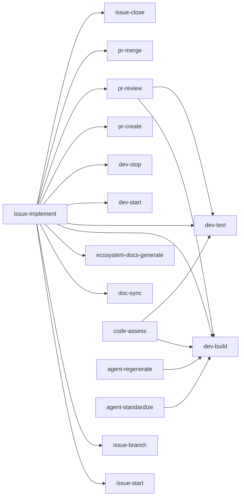
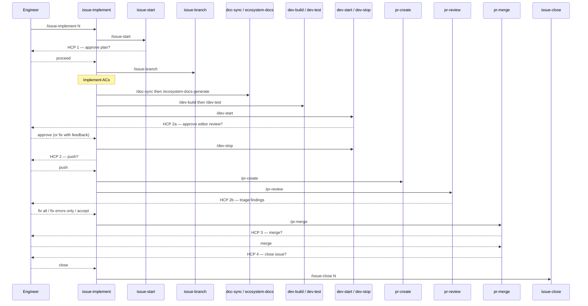

# lob-online Ecosystem Design

> Auto-generated by /ecosystem-docs-generate — do not edit by hand.
> Source of truth: docs/agents/\*/design.md, .claude/agents/registry.json,
> .claude/commands/\*.md, docs/workflows/\*/

lob-online uses Claude Code **agents**, **skills**, and **orchestration** to automate its
development lifecycle. Agents are specialised AI subprocesses with defined responsibility
boundaries and explicit tool allowlists. Skills are reusable Markdown prompt files that
encode step-by-step procedures and compose freely across agent boundaries. Orchestration
sequences agents and skills as version-controlled JSON workflow definitions, with blocking
human gate checkpoints at each consequential transition. For the full reference, see
[`docs/claude-ecosystem/`](claude-ecosystem/).

---

## Skill Sharing: Best Practice Decision

**Skills are freely composable across agents.** Any agent or skill may call any other skill.
Agent ownership records routing accountability, not call restrictions. The alternative —
exclusive ownership — would require duplicating build/test logic in every skill that needs a
quality gate.

### Skill tiers

| Tier             | Examples                                                                               | Description                                                      |
| ---------------- | -------------------------------------------------------------------------------------- | ---------------------------------------------------------------- |
| **Leaf**         | `dev-build`, `dev-start`, `dev-stop`, `dev-test`, `pr-create`, `pr-merge`, `plan-wrap` | No sub-skill dependencies; callable by anyone                    |
| **Composite**    | `pr-review`, `code-assess`                                                             | Call leaf skills as prerequisites                                |
| **Orchestrator** | `issue-implement`                                                                      | Cross-domain; chains skills from multiple agents in one workflow |

---

## Agents

| Agent             | Description                                                       | Primary Skills                                       | Collaborators                    |
| ----------------- | ----------------------------------------------------------------- | ---------------------------------------------------- | -------------------------------- |
| `devops`          | Build, run, and test the dev environment                          | `/dev-build`, `/dev-start`, `/dev-stop`, `/dev-test` | —                                |
| `project-manager` | Manage SDLC: issues → milestones → backlog                        | `/issue-start`, `/issue-branch`, `/issue-implement`  | `issue-intake`, `domain-expert`   |
| `issue-intake`    | Guide issue creation: gather → refine → file issue (no branch/PR) | `/issue-intake`                                      | `domain-expert` (rules gate)      |
| `code-review`     | Quality-gate PR reviews and codebase audits                       | `/pr-review`, `/code-assess`                         | `devops` skills as prerequisites |
| `domain-expert`    | Authoritative LoB v2.0 rules arbiter                              | none                                                 | Consulted by `issue-intake`      |

---

## Skills

| Skill                      | Category | Description                                        | Owning Agent    | Calls                                                                                                                                                                                   |
| -------------------------- | -------- | -------------------------------------------------- | --------------- | --------------------------------------------------------------------------------------------------------------------------------------------------------------------------------------- |
| `/dev-build`               | dev      | Format → lint → Vite build                         | devops          | —                                                                                                                                                                                       |
| `/dev-start`               | dev      | Launch server + Vite client                        | devops          | —                                                                                                                                                                                       |
| `/dev-stop`                | dev      | Graceful shutdown, SIGKILL fallback                | devops          | —                                                                                                                                                                                       |
| `/dev-test`                | dev      | Run suite, detect flakes, correlate errors         | devops          | —                                                                                                                                                                                       |
| `/design`                  | issue    | Gather intent → draft design doc → commit + PR     | unowned         | —                                                                                                                                                                                       |
| `/issue-intake`            | issue    | Gather → refine → HCP → file issue (no branch/PR)  | issue-intake    | `domain-expert`                                                                                                                                                                          |
| `/issue-start`             | issue    | Fetch issue, summarise ACs, HCP 1                  | project-manager | —                                                                                                                                                                                       |
| `/issue-branch`            | issue    | Create feat branch, log update                     | project-manager | —                                                                                                                                                                                       |
| `/issue-implement`         | issue    | Full ticket-to-merge orchestrator                  | project-manager | `/issue-start`, `/issue-branch`, `/doc-sync`, `/ecosystem-docs-generate`, `/dev-build`, `/dev-test`, `/dev-start`, `/dev-stop`, `/pr-create`, `/pr-review`, `/pr-merge`, `/issue-close` |
| `/issue-close`             | issue    | Close GitHub issue with merge summary comment      | unowned         | —                                                                                                                                                                                       |
| `/pr-create`               | pr       | Devlog entry + CI checks + open PR                 | unowned         | —                                                                                                                                                                                       |
| `/pr-review`               | pr       | Build/test gate + PR diff analysis                 | code-review     | `/dev-build`, `/dev-test`                                                                                                                                                               |
| `/pr-merge`                | pr       | Squash-merge + branch delete, HCP 3                | unowned         | —                                                                                                                                                                                       |
| `/plan-wrap`               | plan     | Post-plan: verify build, write devlog, update docs | unowned         | —                                                                                                                                                                                       |
| `/code-assess`             | review   | Full source audit (dead/dup/coverage)              | code-review     | `/dev-build`, `/dev-test`                                                                                                                                                               |
| `/agent-sync`              | agent    | Read-only drift check agents vs design.md          | unowned         | —                                                                                                                                                                                       |
| `/agent-regenerate`        | agent    | Rebuild agent files from design.md §4              | unowned         | `/dev-build`                                                                                                                                                                            |
| `/agent-standardize`       | agent    | Normalize prompt.md, regenerate design + agents    | unowned         | `/dev-build`                                                                                                                                                                            |
| `/doc-sync`                | docs     | Sync CLAUDE.md, HLD, and agent design docs         | unowned         | —                                                                                                                                                                                       |
| `/ecosystem-docs-generate` | docs     | Regenerate all ecosystem docs from source inputs   | unowned         | —                                                                                                                                                                                       |

---

## Skill Dependency Graph

---

## Issue-to-Merge Workflow

---

## Key Files

| File / Path                    | What it is                                                    |
| ------------------------------ | ------------------------------------------------------------- |
| `.claude/agents/*.md`          | Agent definitions (frontmatter + system prompt)               |
| `.claude/agents/registry.json` | Programmatic agent/skill index for the orchestration runtime  |
| `.claude/commands/*.md`        | Skill command files                                           |
| `docs/agents/*/design.md`      | Canonical source of truth for each agent (§4 → agent file)    |
| `docs/workflows/*/`            | WorkflowDefinition JSON + states.md for each workflow         |
| `docs/claude-ecosystem/`       | Full reference hub: agents, skills, orchestration, guardrails |
| `docs/ecosystem-design.md`     | This file — top-level architecture overview                   |
| `server/src/orchestrator/`     | Node.js workflow engine (schemas, registry, runtime)          |

---

## Adding New Agents and Skills

- **New skill:** use [`docs/agents/SKILL_TEMPLATE.md`](agents/SKILL_TEMPLATE.md); see
  [`tutorial-new-agent.md`](claude-ecosystem/tutorial-new-agent.md) for the full 7-step guide.
- **New agent:** use [`docs/agents/PROMPT_TEMPLATE.md`](agents/PROMPT_TEMPLATE.md) and
  [`docs/agents/DESIGN_TEMPLATE.md`](agents/DESIGN_TEMPLATE.md).
- After adding either, run `/agent-sync` to verify consistency, then `/dev-build`.
- **New workflow:** see [`tutorial-orchestration.md`](claude-ecosystem/tutorial-orchestration.md).
