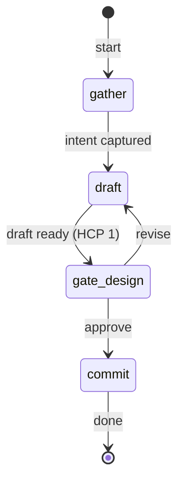

# design — State Machine

## 1. Description

The `design` workflow collaboratively produces a design document for a new or changed
component (orchestrator, skill, or agent) before any issues are written. The engineer
describes the intent in natural language; the agent infers the component type, drafts
`docs/designs/{slug}.md` using the canonical template, and iterates via chat or direct file
edits until the engineer approves. On approval the design file is committed on a
`design/{slug}` branch and a PR is opened.

## 2. State Diagram

## 3. Gate Checkpoint Table

| Step ID        | Prompt summary                                       | Choices          | Default | Loop-back risk                    |
| -------------- | ---------------------------------------------------- | ---------------- | ------- | --------------------------------- |
| `gate-design`  | Design doc shown; approve to open PR or revise       | approve, revise  | approve | `revise` → returns to `draft`     |
