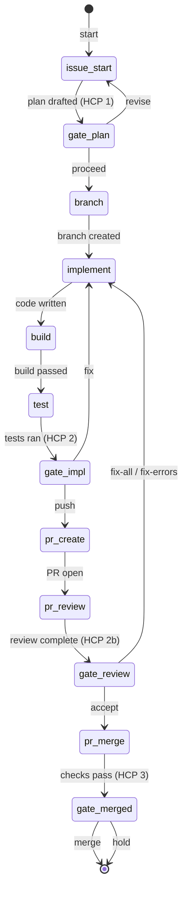

# issue-implement — State Machine

## 1. Description

The `issue-implement` workflow drives the full ticket-to-merge cycle for a GitHub issue.
It sequences issue-start, branch creation, implementation, build, test, PR creation, code
review, and merge, with three human gate checkpoints:

- **HCP 1** (gate-plan) — engineer approves the implementation plan before any code is written
- **HCP 2** (gate-impl) — engineer approves build/test results before the branch is pushed
- **HCP 2b** (gate-review) — engineer decides how to handle PR review findings
- **HCP 3** (gate-merged) — engineer confirms the final squash merge

Loop-back choices at each gate return execution to the appropriate earlier step while
preserving accumulated `WorkflowInstance` state (step outputs, prior gate decisions).

## 2. State Diagram

## 3. Gate Checkpoint Table

| Step ID       | Prompt summary                                     | Choices                     | Default | Loop-back risk                                |
| ------------- | -------------------------------------------------- | --------------------------- | ------- | --------------------------------------------- |
| `gate-plan`   | Plan + AC checklist shown; proceed or revise       | proceed, revise             | proceed | `revise` → re-runs `issue-start`              |
| `gate-impl`   | Build + test results shown; push or fix            | push, fix                   | push    | `fix` → re-runs `implement`; may loop on test |
| `gate-review` | PR review findings; accept, fix-all, or fix-errors | accept, fix-all, fix-errors | accept  | `fix-*` → re-runs `implement`; may loop       |
| `gate-merged` | Final merge approval; merge or hold                | merge, hold                 | merge   | `hold` terminates; no loop                    |
