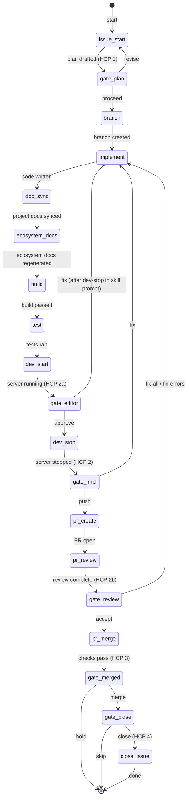

# issue-implement — State Machine

## 1. Description

The `issue-implement` workflow drives the full ticket-to-merge cycle for a GitHub issue.
It sequences issue-start, branch creation, implementation, doc-sync, ecosystem-docs-generate,
build, test, dev-start, editor review, dev-stop, PR creation, code review, merge, and issue
close, with six human gate checkpoints:

- **HCP 1** (gate-plan) — engineer approves the implementation plan before any code is written
- **HCP 2a** (gate-editor) — engineer reviews the running editor and approves or provides fix feedback
- **HCP 2** (gate-impl) — engineer approves doc-sync/build/test results before the branch is pushed
- **HCP 2b** (gate-review) — engineer decides how to handle PR review findings
- **HCP 3** (gate-merged) — engineer confirms the final squash merge
- **HCP 4** (gate-close) — engineer confirms closing the GitHub issue after merge

Loop-back choices at each gate return execution to the appropriate earlier step while
preserving accumulated `WorkflowInstance` state (step outputs, prior gate decisions).

On the **Fix** path at `gate-editor`, the engineer's note is stored as `$.gate-editor.note`
and injected into the next `implement` invocation via `inputMap.editorFeedback`. The skill
prompt instructs the AI to call `/dev-stop` before looping back so the server is never left
running on the fix path. The `dev-stop` call on the Fix path is enforced by the skill prompt,
not the workflow JSON — the JSON schema's loop-back mechanism cannot insert an intermediate
step between a gate choice and its `nextStep` target.

On the **first pass** through `implement`, `gate-editor` has not yet executed and
`$.gate-editor.note` resolves to undefined. The `implement` agent treats an absent or empty
`editorFeedback` value as "no feedback" and proceeds normally — this is documented in the
skill prompt and safe by design.

## 2. State Diagram

## 3. Gate Checkpoint Table

| Step ID       | Prompt summary                                      | Choices                     | Default | Loop-back risk                                           |
| ------------- | --------------------------------------------------- | --------------------------- | ------- | -------------------------------------------------------- |
| `gate-plan`   | Plan + AC checklist shown; proceed or revise        | proceed, revise             | proceed | `revise` → re-runs `issue-start`                         |
| `gate-editor` | Dev server running; approve or provide fix feedback | approve, fix                | approve | `fix` → stops server (skill prompt), re-runs `implement` |
| `gate-impl`   | Doc-sync/build/test results shown; push or fix      | push, fix                   | push    | `fix` → re-runs `implement`; may loop on test            |
| `gate-review` | PR review findings; accept, fix-all, or fix-errors  | accept, fix-all, fix-errors | accept  | `fix-*` → re-runs `implement`; may loop                  |
| `gate-merged` | Final merge approval; merge or hold                 | merge, hold                 | merge   | `hold` terminates; no loop                               |
| `gate-close`  | Issue close confirmation after merge; close or skip | close, skip                 | close   | `skip` terminates; no loop                               |
