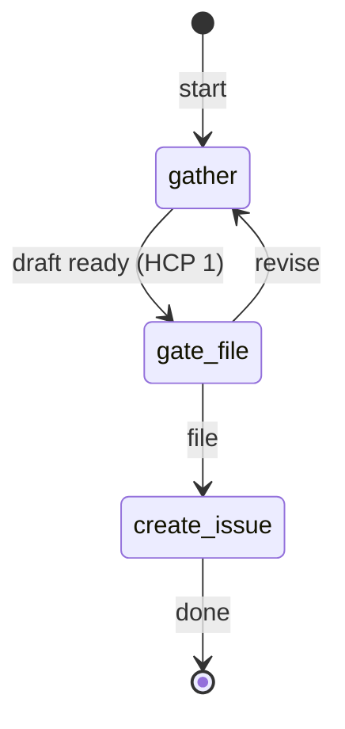

# issue-intake — State Machine

## 1. Description

The `issue-intake` workflow turns a raw requirement into a filed, milestone-assigned GitHub
issue through lightweight interactive conversation. The pipeline gathers and refines the issue
draft with the engineer, gates on explicit approval (HCP 1), then calls `gh issue create`.

No branch is opened, no artifact is committed, and no PR is created. The filed GitHub issue
is the authoritative record.

## 2. State Diagram

## 3. Gate Checkpoint Table

| Step ID     | Prompt summary                             | Choices      | Default | Loop-back risk                 |
| ----------- | ------------------------------------------ | ------------ | ------- | ------------------------------ |
| `gate-file` | Full draft shown; file on GitHub or revise | file, revise | file    | `revise` → returns to `gather` |
