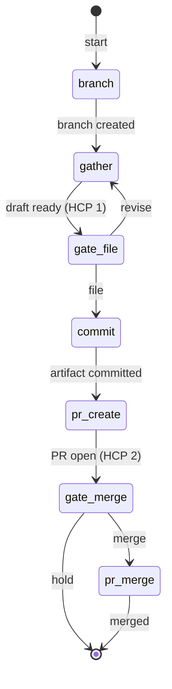

# issue-intake — State Machine

## 1. Description

The `issue-intake` workflow formalises the process of turning a raw requirement into a
version-controlled GitHub issue. The pipeline opens a dedicated `intake/{slug}` branch,
interactively gathers and refines the issue draft with the engineer, files the issue on
GitHub (HCP 1), commits the intake artifact (`docs/intake/YYYY-MM-DD-{slug}.md`), opens
a PR, and merges after explicit engineer approval (HCP 2).

Scope guard: only `docs/`, `.github/`, and `.claude/` paths may be committed on the intake
branch. Source code changes are explicitly prohibited.

## 2. State Diagram

## 3. Gate Checkpoint Table

| Step ID      | Prompt summary                             | Choices      | Default | Loop-back risk                 |
| ------------ | ------------------------------------------ | ------------ | ------- | ------------------------------ |
| `gate-file`  | Full draft shown; file on GitHub or revise | file, revise | file    | `revise` → returns to `gather` |
| `gate-merge` | PR open; merge intake branch or hold       | merge, hold  | merge   | `hold` terminates; no loop     |
