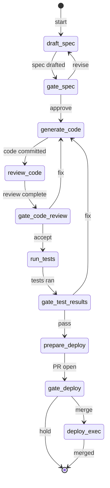

# sdlc-feature — State Machine

## 1. Description

The `sdlc-feature` workflow orchestrates end-to-end delivery of a single feature from initial
specification through deployment. It sequences four agents (`issue-intake`, `issue-implement`,
`code-review`, `dev-test`, `pr-create`, `pr-merge`) separated by four blocking human gate
checkpoints. Each gate pauses execution until an engineer provides an explicit decision;
loop-back choices restart the pipeline from an earlier step without discarding accumulated
`WorkflowInstance` state.

The workflow enforces the following invariant: no code is merged without a human approving both
the code review findings and the test results. The spec gate and deploy gate add additional
control points before implementation begins and before the merge lands on the main branch.

## 2. State Diagram

## 3. Gate Checkpoint Table

| Step ID             | Prompt summary                       | Choices         | Default | Loop-back risk                            |
| ------------------- | ------------------------------------ | --------------- | ------- | ----------------------------------------- |
| `gate-spec`         | Review spec draft; approve or revise | approve, revise | approve | `revise` → re-runs `draft-spec`           |
| `gate-code-review`  | Review findings; accept or fix       | accept, fix     | accept  | `fix` → re-runs `generate-code`; may loop |
| `gate-test-results` | Review test output; pass or fix      | pass, fix       | pass    | `fix` → re-runs `generate-code`; may loop |
| `gate-deploy`       | Final merge approval; merge or hold  | merge, hold     | merge   | `hold` terminates without merge (no loop) |
